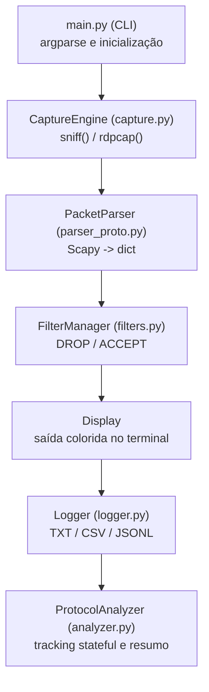
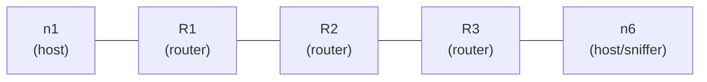

# Relatório Final - Packet Sniffer Passivo

**Universidade do Minho | Licenciatura em Engenharia Informática**  
**Redes de Computadores - Trabalho Prático 2 (2025/2026)**

---

## Índice

1. Introdução e objetivos
2. Arquitetura geral do sistema
    2.1 Visão por módulos  
    2.2 Diagrama do pipeline  
    2.3 Princípio passivo do sniffer
3. Captura e pipeline de processamento
    3.1 Modos de operação  
    3.2 Ordem real do processamento
4. Análise e parsing de protocolos
    4.1 Camada de ligação (ARP)  
    4.2 Camada de rede (IPv4, IPv6, ICMP, ICMPv6, fragmentação)  
    4.3 Camada de transporte (TCP, UDP)  
    4.4 Camada de aplicação (DNS, DHCP, HTTP)
5. Sistema de filtragem
    5.1 Filtros de inclusão/exclusão  
    5.2 BPF + filtro Python  
    5.3 Grupos de protocolos e anti-leakage
6. Mapeamento e correlação de dados
    6.1 TCP handshake/fecho  
    6.2 ARP request/reply  
    6.3 ICMP echo request/reply  
    6.4 Fragmentação  
    6.5 DNS, DHCP e HTTP tracking
7. Apresentação e exportação de resultados
    7.1 Modo consola  
    7.2 Logs TXT/CSV/JSONL  
    7.3 Formato dos campos e consistência dos registos
8. Validação experimental
    8.1 Testes em CORE  
    8.2 Testes em interface real  
    8.3 Exemplos concretos de capturas e resultados
9. Limitações e trabalho futuro
    9.1 Limitações  
    9.2 Trabalho futuro  
10. Conclusão

---

## 1. Introdução e objetivos

Este relatório documenta o desenvolvimento de um **Packet Sniffer Passivo** para captura e análise de tráfego de rede em modo exclusivamente de leitura. O sistema foi implementado em **Python 3** com a biblioteca **Scapy** (>= 2.5.0), mantendo uma separação clara entre captura, parsing, filtragem, apresentação, registo e análise stateful.

### Objetivos principais

1. Capturar tráfego em tempo real numa interface de rede (Ethernet ou Wi-Fi) ou a partir de ficheiros `.pcap`.
2. Extrair e apresentar campos relevantes no modelo de 5 camadas TCP/IP (Aplicação, Transporte, Rede, Ligação e Física), incluindo MAC, IP, TCP/UDP, ICMP, DNS, DHCP e HTTP.
3. Manter correlação stateful de protocolos (handshake TCP, pares ARP/ICMP, sequência DHCP DORA e emparelhamento DNS/HTTP).
4. Disponibilizar filtragem avançada por IP, MAC, protocolo e porto, com dupla camada (BPF + Python).
5. Exportar resultados para TXT, CSV e JSONL com `flush` imediato por pacote.
6. Validar o comportamento em ambiente emulado (CORE) e em interface real.

### Restrições de operação

- Requer privilégios `root`/`sudo` para acesso a raw sockets.
- Funciona em modo passivo: não injeta, não altera e não reencaminha pacotes.
- A visibilidade é End-to-End (E2E): observa apenas o tráfego visível na interface local.

---

## 2. Arquitetura geral do sistema

### 2.1 Visão por módulos

O projeto está organizado em seis módulos com responsabilidades independentes:

- `main.py`: interface CLI, validação de argumentos e inicialização.
- `capture.py`: motor de captura em tempo real e leitura de `.pcap`.
- `parser_proto.py`: conversão de pacote Scapy para registo normalizado.
- `filters.py`: decisão DROP/ACCEPT (filtros BPF e Python).
- `logger.py`: persistência em TXT, CSV e JSONL.
- `analyzer.py`: correlação stateful, estatísticas e diagramas ASCII.



### 2.2 Diagrama do pipeline

A ordem do pipeline de processamento é fixa e consistente em todo o projeto:

`parse -> filter -> display -> log -> analyze`

- O parser cria o registo comum.
- O filtro decide se o pacote é aceite.
- A apresentação e o logging atuam apenas sobre pacotes aceites.
- O analisador recebe apenas pacotes aceites, garantindo ausência de leakage de estado.

[INSERIR PRINT: excerto de `capture.py` com `_process()` e a ordem completa do pipeline]

### 2.3 Princípio passivo do sniffer

O sniffer opera com cópia de pacotes recebidos pela interface local, sem alteração do fluxo de rede:

- acesso em leitura a raw sockets;
- ausência de técnicas ativas (MITM, spoofing, injeção);
- suporte a captura live e análise offline de `.pcap`.

Esta abordagem garante conformidade com o objetivo de observação passiva.

---

## 3. Captura e pipeline de processamento

### 3.1 Modos de operação

O sistema suporta três modos principais:

1. **Captura em interface real**: `-i <interface>` para captura contínua.
2. **Leitura de ficheiro `.pcap`**: `--pcap <ficheiro>` para análise offline.
3. **Listagem de interfaces**: opção CLI para enumerar interfaces disponíveis.

Exemplos:

```bash
sudo python3 main.py -i eth0 --analyze
sudo python3 main.py -i wlan0 --analyze
sudo python3 main.py --pcap captura.pcap --analyze
```

Em caso de falta de permissão, a captura live em raw sockets é bloqueada pelo sistema operativo.

### 3.2 Ordem real do processamento

Para cada pacote recebido, o pipeline segue os passos abaixo:

1. Inicialização de registo base (`_empty_record()`).
2. Parsing de cabeçalhos e campos (`parse()`).
3. Aplicação de filtros (`FilterManager.match()`).
4. Apresentação em consola (`_display()`).
5. Escrita de registo (`Logger.write()`).
6. Correlação stateful (`ProtocolAnalyzer.analyze()`).

Este encadeamento garante separação entre decisões de filtragem e lógica de análise de estado.

---

## 4. Análise e parsing de protocolos

### 4.1 Camada de ligação

#### ARP

O parser extrai opcode, MAC e IP de origem/destino, classificando mensagens como Request/Reply. O resumo inclui o tipo de operação para leitura imediata na consola.

No contexto das 5 camadas, ARP é tratado na fronteira Ligação/Rede, pois suporta a resolução de endereços entre estas camadas.

### 4.2 Camada de rede

#### IPv4

Campos extraídos: endereços, `ttl`, `id`, flags de fragmentação (`MF`/`DF`), offset e comprimento.

#### IPv6

Campos extraídos: origem/destino, `hop_limit` e identificação de fragmentação IPv6 quando existe um cabeçalho `IPv6ExtHdrFragment`.

#### ICMP

O parser reconhece Echo Request, Echo Reply, Destination Unreachable e Time Exceeded, incluindo mensagens de erro associadas a TTL expirado e à reassemblagem de fragmentos. Estes eventos são resumidos em campo próprio para apresentação no terminal.

#### ICMPv6

Neste estado do projeto, o suporte ICMPv6 está centrado em Echo Request e Echo Reply, bem como nas mensagens de erro `Dest Unreach` e `Time Exceeded`. As mensagens de Neighbor Discovery e Router Advertisement não são tratadas explicitamente pelo parser atual, pelo que ficam como trabalho futuro caso se pretenda cobrir o conjunto completo de ICMPv6.

#### Fragmentação

A deteção de fragmentos IPv4 é feita no parsing, através das flags `MF`/`DF` e do offset, e essa informação segue para o `FragmentTracker`, onde os fragmentos são correlacionados por identificação e origem/destino.

### 4.3 Camada de transporte

#### TCP

Extração de portos, flags (`SYN`, `ACK`, `FIN`, `RST`), números de sequência/acknowledgment e tamanho efetivo de payload.

#### UDP

Extração de portos e comprimento, com encaminhamento para classificação de protocolos de aplicação sobre UDP (DNS e DHCP).

### 4.4 Camada de aplicação

#### DNS

Deteção de Query/Response por `qr`, com extração de `dns_id`, nome, tipo de consulta e estado de resposta.

#### DHCP

Deteção por portos `67/68` e campos BOOTP/DHCP. O parser recolhe `xid`, tipo de mensagem e metadados essenciais para o ciclo DORA:

- Discover
- Offer
- Request
- ACK

#### HTTP

Deteção de requests e responses em TCP porto 80, com identificação de método, URI e códigos de resposta quando disponíveis.

Nota: a camada Física é observada de forma indireta (via interface e driver) e não é dissecada ao nível de bits neste projeto; por isso, a análise detalhada incide nas camadas Ligação, Rede, Transporte e Aplicação.

---

## 5. Sistema de filtragem

### 5.1 Filtros de inclusão/exclusão

Os filtros suportam critérios por:

- protocolo (`--proto`, `--exclude-proto`);
- IP de origem/destino;
- MAC de origem/destino;
- porto de origem/destino;
- limites de captura (número de pacotes e duração).

A prioridade de exclusão é absoluta quando há contradições explícitas (ex.: incluir e excluir o mesmo protocolo).

### 5.2 BPF + filtro Python

A filtragem é implementada em duas camadas:

1. **BPF (kernel-space)**: reduz volume antes da entrega ao processo Python.
2. **Filtro Python**: valida regras finais sobre o registo parseado.

Se a interface não suportar o BPF gerado, existe fallback para captura sem BPF, mantendo a validação Python.

### 5.3 Grupos de protocolos e anti-leakage

Para evitar classificações incorretas e leakage:

- protocolos de aplicação são identificados antes dos genéricos quando necessário (ex.: DNS antes de UDP puro);
- exclusões propagam-se por grupos lógicos;
- a contagem final obedece ao invariante `accepted + dropped == total`.

Exemplo de grupos:

```python
_PROTO_GROUP = {
    "TCP": {"TCP", "HTTP"},
    "UDP": {"UDP", "DNS", "DHCP"},
}
```

---

## 6. Mapeamento e correlação de dados

### 6.1 TCP handshake/fecho

A estrutura `TCPState` implementa máquina de estados direcional:

- `SYN -> SYN_SENT`
- `SYN+ACK -> SYN_RECEIVED`
- `ACK -> ESTABLISHED`
- `FIN/RST -> encerramento`

Durante `ESTABLISHED`, a progressão de ACKs permite estimar bytes transferidos por direção.

### 6.2 ARP request/reply

Emparelhamento por IP solicitado:

- Request regista pendência;
- Reply fecha o par e atualiza tabela ARP observada.

### 6.3 ICMP echo request/reply

Emparelhamento por chave composta `(src_ip, dst_ip, icmp_id)` para evitar colisões entre sessões simultâneas.

### 6.4 Fragmentação

`FragmentTracker` agrega fragmentos por chave `(src_ip, dst_ip, frag_id)` e aplica timeout de limpeza para fragmentos incompletos.

### 6.5 DNS, DHCP e HTTP tracking

- **DNS**: emparelhamento Query/Response por `dns_id`.
- **DHCP**: sequência DORA por `dhcp_xid`.
- **HTTP**: emparelhamento request/response por tuplo de conexão `(client_ip, server_ip, client_port)`.

Estruturas principais mantidas em memória:

| Estrutura | Chave | Propósito |
|---|---|---|
| `tcp_flows` | `ip:porto <-> ip:porto` | Estado TCP completo |
| `arp_pending` | `dst_ip` | Request/Reply ARP |
| `icmp_sessions` | `(src_ip, dst_ip, icmp_id)` | Echo Request/Reply |
| `frag_tracker._pending` | `(src_ip, dst_ip, frag_id)` | Agrupamento de fragmentos |
| `dns_tracker._pending` | `dns_id` | Query/Response DNS |
| `dhcp_tracker._sessions` | `dhcp_xid` | Sequência DORA |
| `http_tracker._pending` | `(client_ip, server_ip, client_port)` | Request/Response HTTP |

---

## 7. Apresentação e exportação de resultados

### 7.1 Modo consola

A saída live usa códigos ANSI para destacar protocolo e contexto:

- marcadores `[REQUEST]`, `[REPLY]`, `[ERRO]`, `[FIN]`, `[RST]`;
- alertas de TTL baixo e `ICMP Time Exceeded`;
- visualização resumida para acompanhamento em tempo real.

### 7.2 Logs TXT/CSV/JSONL

O módulo de logging suporta três formatos:

| Formato | Flag | Ficheiro | Uso |
|---|---|---|---|
| TXT | `--log txt` | `captura.txt` | leitura humana |
| CSV | `--log csv` | `captura.csv` | análise tabular |
| JSONL | `--log json` | `captura.jsonl` | processamento automatizado |

Todos os formatos usam `flush()` por pacote para reduzir perda de dados em interrupções.

A origem da captura pode ser live ou `.pcap`; o formato de exportação mantém-se uniforme nos dois casos.

### 7.3 Formato dos campos e consistência dos registos

O `PacketParser` produz um DTO plano com chaves estáveis para todo o pipeline. Quando um campo não existe no protocolo observado, o valor é `None`, evitando falhas por chave ausente.

Vantagens:

- consistência entre consola, filtros, logs e analisador;
- menor acoplamento com objetos Scapy;
- robustez contra `KeyError` em fluxos heterogéneos.

---

## 8. Validação experimental

### 8.1 Testes em CORE

Topologia usada para validação controlada:



Testes executados:

| Teste | Comando | Protocolos observados |
|---|---|---|
| Ping | `ping 10.0.3.20` | ARP + ICMP |
| TCP | `nc -l 80` / `echo test | nc ...` | handshake + dados + fecho |
| DNS | `nslookup example.com ...` | Query/Response |
| DHCP | `dhclient eth0` | DORA completo |
| Fragmentação | `ping -s 4000 ...` | fragmentos IPv4 |

### 8.2 Testes em interface real

Execução em interfaces reais (Wi-Fi/Ethernet):

```bash
sudo python3 main.py -i wlan0 --analyze
sudo python3 main.py -i enp3s0 --analyze
```

Observações principais:

- maior volume de ruído de fundo (mDNS, SSDP, broadcasts);
- predomínio de HTTPS (payload cifrado);
- presença frequente de IPv6/ICMPv6 em redes modernas;
- necessidade de filtragem para isolamento de cenários.

### 8.3 Exemplos concretos de capturas e resultados

Exemplos de execução:

```bash
# Captura live
sudo python3 main.py -i eth0 --analyze

# Análise offline + exportação CSV
sudo python3 main.py --pcap captura.pcap --analyze --log csv --output sessao

# Apenas DNS
sudo python3 main.py -i eth0 --proto DNS --analyze -n 50

# Excluir TCP/HTTP e exportar JSONL
sudo python3 main.py -i eth0 --exclude-proto TCP --log json --output sem_tcp
```

[INSERIR PRINT: consola live com tags REQUEST/REPLY e alertas TTL]
[INSERIR PRINT: excerto de `captura.csv` e `captura.jsonl`]

---

## 9. Limitações e trabalho futuro

### 9.1 Limitações

- Tráfego HTTPS/TLS não é decifrado (sem chaves de sessão).
- A captura live depende de privilégios de administrador.
- Em rede comutada, a visibilidade limita-se ao tráfego local e broadcast/multicast.
- `DNSTracker` e `HTTPTracker` não implementam garbage collection agressiva de pendências.
- Em Wi-Fi sem modo monitor, não há visibilidade total de frames 802.11.

### 9.2 Trabalho futuro

- Interface gráfica para exploração de sessões e eventos.
- Suporte adicional a protocolos aplicacionais (ex.: HTTP/2 e metadata TLS mais detalhada).
- Deteção automática de anomalias (scans, retransmissões excessivas, loops).
- Exportação de métricas e gráficos temporais.
- Otimizações de desempenho para capturas longas com alto volume.

---

## 10. Conclusão

O projeto cumpriu os objetivos definidos: captura passiva em tempo real e offline, parsing multicamada, filtragem robusta, correlação stateful e exportação estruturada de resultados.

A arquitetura modular permitiu separar com clareza as responsabilidades de captura, parsing, filtro, logging e análise, reduzindo acoplamento e facilitando manutenção. A validação em CORE e em interface real confirmou o funcionamento para ARP, ICMP, TCP, UDP, DNS, DHCP e HTTP nos cenários previstos.

Apesar das limitações inerentes a um sniffer passivo (nomeadamente conteúdo cifrado em TLS e visibilidade parcial em redes comutadas), a solução demonstra relevância técnica e pedagógica, consolidando conceitos de protocolos, pilha de rede e observabilidade de tráfego em ambiente real.

---

**Ficheiros do projeto:**

```text
src/
├── main.py           # CLI e inicialização
├── capture.py        # Motor de captura live/pcap
├── parser_proto.py   # Parsing multicamada
├── filters.py        # Filtros BPF + Python
├── analyzer.py       # Correlação stateful e resumo
└── logger.py         # Exportação TXT/CSV/JSONL
```
