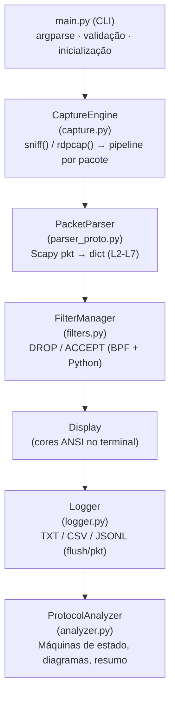
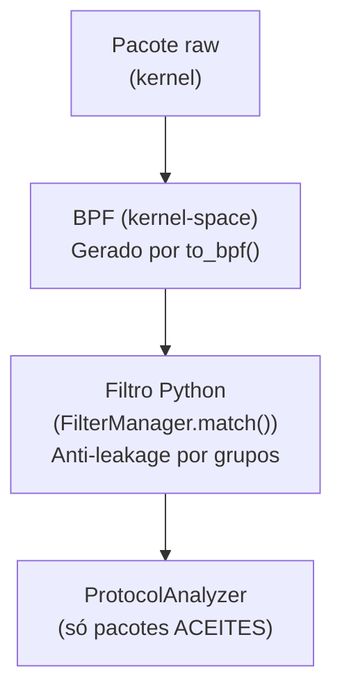
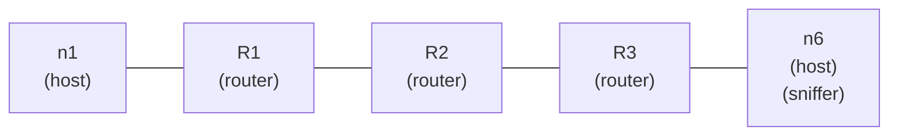
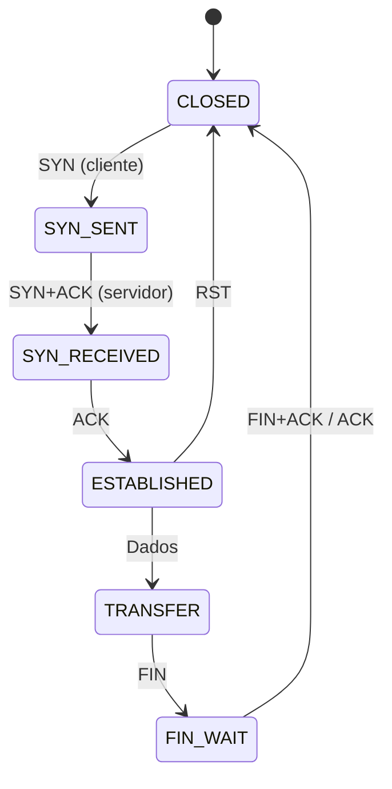

# Relatório Final — Packet Sniffer Passivo

**Universidade do Minho | Licenciatura em Engenharia Informática**  
**Redes de Computadores — Trabalho Prático 2 (2025/2026)**

---

## 1. Introdução e Objetivos

O presente relatório documenta o desenvolvimento de um **Packet Sniffer Passivo** — uma ferramenta de captura e análise de tráfego de rede que opera exclusivamente em modo de leitura, sem qualquer forma de injeção de pacotes, modificação de fluxo ou interceção ativa (MITM).

O sistema foi implementado em **Python 3** com recurso à biblioteca **Scapy** (≥ 2.5.0) e cobre a extração completa de campos das camadas L2 a L7, com tracking stateful de fases de protocolo (handshakes TCP, ciclos de resolução ARP/ICMP, sequências DORA do DHCP e emparelhamento DNS).

### Objetivos Principais

1. Capturar tráfego em tempo real numa interface de rede (Ethernet ou Wi-Fi) ou a partir de ficheiros `.pcap`.
2. Extrair e apresentar campos relevantes de cada camada (MAC, IP, TCP/UDP, ICMP, DNS, DHCP, HTTP).
3. Manter máquinas de estado para rastrear fases completas de protocolo (handshake TCP, ciclo DORA, pares Request/Reply).
4. Oferecer filtragem avançada de pacotes (por IP, MAC, protocolo, porto) com dupla camada (BPF + Python).
5. Exportar dados para ficheiros de log (TXT, CSV, JSONL) com resistência a crash via flush imediato.
6. Gerar **diagramas de protocolo ASCII** e um **bloco de resumo estatístico** no final da captura.
7. Ser compatível com execução em ambientes emulados via **CORE Network Emulator** e em interfaces reais.

### Restrições de Operação

- Requer `root`/`sudo` para acesso a raw sockets.
- Captura estritamente End-to-End (E2E): analisa o tráfego visível no end-host.
- Não modifica, não reencaminha e não gera pacotes.

---

## 2. Arquitetura do Sistema e Diagramas

O código está organizado em **seis módulos** com responsabilidades mutuamente exclusivas. Nenhum módulo toma decisões que pertencem a outro:



### Separação Crítica: Filtragem vs Análise

| Propriedade | FilterManager | ProtocolAnalyzer |
|---|---|---|
| **Função** | Decide DROP/ACCEPT | Rastreia estado de protocolo |
| **Vê pacotes raw?** | Não (opera sobre o dict) | Sim (recebe dict + pkt Scapy) |
| **Altera estado?** | Nunca | Sim (máquinas de estado) |
| **Pode ver pacotes descartados?** | N/A (ele é quem decide) | **Nunca** — só vê aceites |
| **Dependência entre módulos** | Nenhuma com Analyzer | Nenhuma com Filter |

Esta separação garante que o `ProtocolAnalyzer` **nunca vê pacotes rejeitados** pelo filtro, e que o `FilterManager` **nunca acede a estado de sessão** — as duas responsabilidades não se misturam em nenhum ponto do código.

[INSERIR PRINT: Excerto de `capture.py` mostrando o pipeline `_process()` — onde se vê a ordem parse → filter → display → log → analyze]

---

## 3. Estruturas de Armazenamento

### Justificação do Uso de Dicionários (`dict`)

O `analyzer.py` utiliza **dicionários Python** como estrutura de dados principal para todas as tabelas de estado:

| Estrutura | Chave (tuplo) | Valor | Propósito |
|---|---|---|---|
| `tcp_flows` | `"ip:port <-> ip:port"` (string canónica) | Objeto `TCPState` | Rastrear handshake e dados por flow |
| `icmp_sessions` | `(src_ip, dst_ip, icmp_id)` | timestamp | Emparelhar Echo Request/Reply |
| `arp_pending` | `dst_ip` (IP pedido) | timestamp | Emparelhar ARP Request/Reply |
| `dns_tracker._pending` | `dns_id` (Transaction ID) | `{name, qtype, src, ts}` | Emparelhar Query/Response |
| `dhcp_tracker._sessions` | `dhcp_xid` (BOOTP Transaction ID) | `{phase, client_mac, ...}` | Rastrear ciclo DORA |
| `frag_tracker._pending` | `(src_ip, dst_ip, frag_id)` | `{fragments: [...], wall, ...}` | Agrupar fragmentos IP |

**Justificação de desempenho**: Os dicionários em Python são implementados como hash tables, garantindo complexidade **O(1) amortizada** para operações de procura e inserção. Isto é crítico num sniffer em tempo real, onde cada pacote deve ser processado em microssegundos para não perder frames subsequentes. A alternativa (listas com busca linear O(n)) seria inviável com centenas de sessões simultâneas.

A utilização de **tuplos como chaves** (e.g., `(src_ip, dst_ip, icmp_id)`) é possível porque os tuplos são imutáveis e hashable em Python, oferecendo uma chave composta natural sem necessidade de concatenação de strings.

### Garbage Collection

O `FragmentTracker` implementa GC por timeout (30 segundos): fragmentos que não recebem o último pedaço dentro deste intervalo são descartados e reportados. Este mecanismo é invocado em cada nova chegada de fragmento (`_gc()` no início de `process()`).

[INSERIR PRINT: Excerto de `analyzer.py` — secção do `FragmentTracker._gc()` e da estrutura `_pending`]

---

## 4. Filtragem vs Validação e Edge Cases

### Dupla Camada de Filtragem

O sistema implementa **dois mecanismos de filtragem em série**, cada um com vantagens complementares:



### Anti-Leakage por Grupos de Protocolo

O filtro conhece relações de continência entre protocolos:

```python
_PROTO_GROUP = {
    "TCP": {"TCP", "HTTP"},     # Excluir TCP exclui HTTP
    "UDP": {"UDP", "DNS", "DHCP"},  # Excluir UDP exclui DNS e DHCP
}
```

Isto garante que `--exclude-proto TCP` descarta **também** pacotes HTTP (que são TCP no porto 80). Sem esta expansão, existiria *leakage*: pacotes TCP no porto 80 passariam pela exclusão por terem `proto=HTTP`.

### Cenários de Edge Case

| Cenário | Comportamento |
|---|---|
| `--proto TCP --exclude-proto TCP` | Contradição detectada na inicialização. Aviso emitido. Nenhum pacote passa (exclusão tem prioridade absoluta). |
| Interface sem tráfego correspondente ao filtro | 0 pacotes aceites, 0 ou N dropped, sem erro. |
| BPF não suportado na interface | Fallback automático: captura sem BPF + filtro Python mantém-se activo. Aviso impresso. |
| Filtro por IP inexistente | Todos os pacotes são descartados pelo filtro Python. `accepted = 0`. |

### Invariante de Contagem

No final de cada captura, o sistema verifica:

```python
assert accepted + dropped == total, "INVARIANTE VIOLADO: leakage de contagem!"
```

Se esta condição falhar, significa que existem pacotes não contabilizados — um bug de leakage no pipeline.

[INSERIR PRINT: Terminal mostrando output com filtros activos e estatísticas `[stats] Total: X | Aceites: Y | Filtrados: Z (W%)`]

---

## 5. Validação e Análise de Protocolos

### 5.1 TCP — Máquina de Estados Completa

A classe `TCPState` implementa uma máquina de estados **direcional** — distingue pacotes do cliente (iniciador do SYN) e do servidor:

```
           Cliente                          Servidor
              │                                │
              │─── SYN (seq=x) ───────────────→│   CLOSED → SYN_SENT
              │                                │
              │←── SYN+ACK (seq=y, ack=x+1) ──│   SYN_SENT → SYN_RECEIVED
              │                                │
              │─── ACK (ack=y+1) ─────────────→│   SYN_RECEIVED → ESTABLISHED ✓
              │                                │
              │      ═══ TRANSFERÊNCIA DE DADOS ═══
              │    (tracking bytes via progressão de ACK)
              │                                │
              │─── FIN ───────────────────────→│   ESTABLISHED → FIN_WAIT
              │                                │
              │←── FIN+ACK ────────────────────│   FIN_WAIT → CLOSED (FIN) ✓
              │                                │
              │═══ OU A QUALQUER MOMENTO: ═════│
              │─── RST ───────────────────────→│   Qualquer → CLOSED (RST)
```

**Tracking de dados**: Durante a fase `ESTABLISHED`, os bytes transferidos são estimados pela progressão dos números de ACK em cada direção, com guarda contra wrap-around do espaço de sequência (delta máximo de 1 GB).

**Verificação direcional**: Um `SYN+ACK` só é aceite se vier do servidor; o `ACK` de conclusão do handshake só é aceite se vier do cliente. Isto previne falsos positivos em cenários de retransmissão.

### 5.2 ARP — Emparelhamento Request / Reply

```python
# Chave: dst_ip (IP pedido no Request)
if "Request" in summary:
    self.arp_pending[p["dst_ip"]] = timestamp

elif "Reply" in summary:
    if src_ip in self.arp_pending:
        # Troca completa! Registar na tabela ARP
        self.arp_table[src_ip] = src_mac
        del self.arp_pending[src_ip]
```

O ciclo fecha-se quando um Reply vem de um IP que estava na tabela de pendentes.

### 5.3 ICMP — Emparelhamento por Sessão e Análise de TTL

O protocolo ICMP é rastreado em duas dimensões complementares:

#### 5.3.1 Echo Request / Echo Reply (Ping)

```python
# Chave: (src_ip, dst_ip, icmp_id)
if icmp_type == 8:  # Echo Request
    key = (src_ip, dst_ip, icmp_id)
    self.icmp_sessions[key] = timestamp

elif icmp_type == 0:  # Echo Reply
    key = (dst_ip, src_ip, icmp_id)  # chave invertida!
    if key in self.icmp_sessions:
        # Par completo
        del self.icmp_sessions[key]
```

O campo `icmp_id` distingue sessões de ping simultâneas do mesmo host, eliminando colisões que ocorreriam com chaves baseadas apenas em IPs.

#### 5.3.2 Time Exceeded — Análise de TTL (Time To Live)

O sniffer implementa detecção e monitoramento automático de situações de **TTL expirado**:

```python
# Análise de TTL em parser_proto.py
elif icmp.type == 11:  # ICMP Time Exceeded (TTL expirado)
    rec["ttl_exceeded"] = True  # marcador de situação crítica
    detail = ""
    if icmp.haslayer(IP):
        inner = icmp[IP]
        detail = f" (orig TTL={inner.ttl} {inner.src} > {inner.dst})"
    rec["summary"] = f"ICMP Time Exceeded: TTL exceeded in transit{detail}"
```

Quando um pacote viaja através de múltiplos routers, cada router decrementa o TTL. Quando o TTL chega a zero antes do pacote atingir o destino, o router que recebe um TTL=0 gera uma mensagem ICMP Type 11 (Time Exceeded) de volta ao remetente.

**Visualização em tempo real:**

No terminal, os pacotes com TTL expirado são exibidos com:
- Mensagem **`[TIME TO LIVE EXCEEDED]`** em **vermelho** no campo de resumo
- A mensagem inclui o TTL original do pacote que expirou
- Campo TTL permanece em cinza (é o TTL do pacote ICMP de resposta, não do original)

Além disso, pacotes normais com TTL muito baixo (0 ou 1) são alertados com:
- Campo TTL em **vermelho** e precedido por **`⚠ TTL MUITO BAIXO!`** no final da linha

```
  1   12:34:56.789 192.168.1.100      8.8.8.8             ICMP     11       84B [TIME TO LIVE EXCEEDED] ICMP Time Exceeded: TTL exceeded in transit
  2   12:34:56.790 10.0.0.5           10.0.0.1            IPv4     1        512B Summary ⚠ TTL MUITO BAIXO!
```

**Casos de Uso Práticos:**

| Cenário | TTL Observado | Causa |
|---|---|---|
| Host local (sem roteadores) | 64 ou 255 (OS-dependente) | Remetente define TTL alto |
| Atravessamento de N routers | 64 - N | Cada router decrementa |
| Traceroute bem-sucedido | Variável (1, 2, 3...) | Intencionalmente incrementado para descoberta |
| Pacote perdido (ICMP Time Exceeded) | Mensagem Type 11 | TTL atingiu 0 no caminho |

O rastreamento de TTL é essencial para:
- **Diagnosticar loops de encaminhamento**: Se um traceroute nunca atinge o destino (apenas Time Exceeded), há uma rota malformada.
- **Detectar fragmentação anómala**: Fragmentos com TTL crescente indicam retransmissão ou reencaminhamento inesperado.
- **Verificar MPLS/túneis**: Pacotes dentro de túneis podem ter TTLs em camadas múltiplas.

### 5.4 DNS — Emparelhamento por Transaction ID

```python
# Chave: dns_id (Transaction ID de 16 bits)
if dns_qr == 0:  # Query
    self._pending[dns_id] = {"name": name, "qtype": qtype, ...}

elif dns_qr == 1:  # Response
    if dns_id in self._pending:
        req = self._pending.pop(dns_id)  # par completo
```

### 5.5 DHCP — Ciclo DORA via `dhcp_xid`

```python
# Chave: dhcp_xid (BOOTP Transaction ID)
# Sequência: Discover → Offer → Request → ACK
if msg_type == "ACK":
    ip = sess["offered_ip"]
    del self._sessions[xid]
    self.completed += 1
    # Ciclo DORA completo!
```

### 5.6 HTTP — Emparelhamento por Tuplo de Conexão

```python
# Chave: (client_ip, server_ip, client_port)
# Request: dst_port == 80 e método HTTP presente
# Response: src_port == 80 e porto destino == porto efémero do request
```

### 5.7 Visualização em Tempo Real — Formatação com Cores ANSI e Alertas de TTL

A camada de apresentação (`capture.py` — função `_display()`) implementa uma visualização colorida e contextualizada de cada pacote, destacando protocolos, erros e anomalias através de sequências ANSI:

#### 5.7.1 Esquema de Cores por Protocolo

| Protocolo | Cor | Código ANSI |
|---|---|---|
| TCP | Verde | `\033[92m` |
| UDP | Azul | `\033[94m` |
| ARP | Amarelo | `\033[93m` |
| ICMP | Ciano | `\033[96m` |
| DNS | Vermelho | `\033[91m` |
| HTTP | Magenta | `\033[95m` |
| DHCP | Branco | `\033[97m` |
| IPv4/IPv6 | Cinza | `\033[90m` |

#### 5.7.2 Marcadores Contextuais

Além da cor do protocolo, o resumo (`summary`) do pacote é enriquecido com marcadores que indicam o papel do pacote na comunicação:

| Marcador | Cor | Significado |
|---|---|---|
| `[REQUEST]` | Ciano | Pedido do cliente (DNS Query, HTTP GET, ICMP Echo Request, etc.) |
| `[REPLY]` | Verde | Resposta do servidor (DNS Response, HTTP Response, etc.) |
| `[TCP REQUEST - SYN]` | Ciano | Iniciação de handshake TCP |
| `[TCP REPLY - SYN+ACK]` | Verde | Servidor responde ao handshake TCP |
| `[ERRO]` | Vermelho | Condições de erro (Dest Unreachable, Time Exceeded, etc.) |
| `[FIN - Terminação]` | Vermelho | Encerramento de conexão TCP |
| `[RST - Reset]` | Vermelho | Reset forçado da conexão TCP |

#### 5.7.3 Alertas de TTL

**Situação 1: Pacote com TTL muito baixo (0 ou 1)**

Quando um pacote IPv4 ou IPv6 chega com TTL ≤ 1, o campo de TTL é exibido em **vermelho** com um alerta adicional na linha:

```
  42   12:35:12.456 192.168.1.100      8.8.8.8             IPv4     1        512B ⚠ TTL MUITO BAIXO!
                                                                            ↑
                                                                    Em vermelho
```

Isto indica que o pacote tem apenas 1 salto remanescente — se atravessar outro router, será descartado e gerará um ICMP Time Exceeded.

**Situação 2: Pacote ICMP Time Exceeded (TTL expirado no caminho)**

Quando a captura recebe um ICMP Type 11 (Time Exceeded), o parser marca `ttl_exceeded = True` e a exibição em tempo real mostra:

```
  43   12:35:12.457 192.168.1.1        192.168.1.100       ICMP     64       56B [TIME TO LIVE EXCEEDED] ICMP Time Exceeded: TTL exceeded in transit (orig TTL=1 10.0.0.5 > 8.8.8.8)
                                                                            ↑
                                                                    Em vermelho
```

O resumo completo inclui:
- O TTL original do pacote que expirou
- Os endereços IP do pacote original (extraído do cabeçalho ICMP encapsulado)

#### 5.7.4 Exemplo de Saída com Múltiplos Alertas

```
   1   12:30:00.100 192.168.1.100      192.168.1.1         ICMP     64       32B [REQUEST] Echo Request id=1234 seq=1
   2   12:30:00.150 192.168.1.1        192.168.1.100       ICMP     64       32B [REPLY] Echo Reply id=1234 seq=1
   3   12:30:01.100 10.0.0.5           8.8.8.8             IPv4     2        512B ⚠ TTL MUITO BAIXO!
       |_ FRAG id=54321 off=0B last DF
   4   12:30:01.150 192.168.0.1        10.0.0.5            ICMP     64       56B [ERRO] [TIME TO LIVE EXCEEDED] ICMP Time Exceeded: TTL exceeded in transit (orig TTL=1 10.0.0.5 > 8.8.8.8)
```

**Interpretação da saída acima:**

- Linhas 1-2: Ping bem-sucedido (Request/Reply emparelhado)
- Linha 3: Pacote saindo da interface local com TTL=2 (alerta porque está muito perto de expirar)
- Linha 4: Um dos routers pelo caminho gerou este ICMP Time Exceeded porque o TTL chegou a 0 antes de atingir 8.8.8.8

Esta combinação de alertas permite ao utilizador **diagnosticar problemas de encaminhamento em tempo real** sem necessidade de ferramentas externas como `traceroute`.

[INSERIR PRINT: Código da classe `TCPState.transition()` mostrando as transições SYN→SYN_SENT→SYN_RECEIVED→ESTABLISHED]

[INSERIR PRINT: Terminal a mostrar output live com tags `[REQUEST]`/`[REPLY]` coloridas — emparelhamento ICMP e ARP visível, incluindo alertas de TTL]

---

## PARTE A — Instanciação e Captura na Rede Emulada (CORE)

## 6. Topologia CORE e Justificação do Nó de Execução

### Topologia Utilizada

A topologia criada no CORE permite demonstrar todos os protocolos alvo: ARP (resolução local), ICMP (ping entre nós), TCP (transferências HTTP via netcat ou serviços locais), UDP (DNS e DHCP), e fragmentação IP (com pacotes superiores ao MTU).



### Porquê Executar no Host (nó n6) e Não num Router

O sniffer é executado num **end-host** (máquina final na topologia) e não num router de trânsito. Esta decisão é fundamental:

1. **Objetivo E2E**: O propósito é inspecionar o tráfego que **chega ou sai** de uma máquina final — exatamente o que uma aplicação real (browser, cliente DNS, etc.) vê. Um router de trânsito vê tráfego de terceiros que não lhe é destinado.

2. **Sem MITM**: Capturar num router implicaria inspecionar tráfego de trânsito entre outros hosts, o que constitui interceção ativa. O nosso sniffer é **puramente passivo** — só lê cópias dos frames que passam na interface do host.

3. **Rastreamento de Estado Coerente**: As máquinas de estado (TCP handshake, DHCP DORA) só fazem sentido do ponto de vista de um participante na comunicação. Num router, veríamos apenas pacotes em trânsito sem contexto completo da sessão.

4. **Interface Promíscua Desnecessária**: No end-host, todos os pacotes capturados são legitimamente destinados a ou originados por essa máquina (ou broadcasts). Não é necessário modo promíscuo.

### Testes Realizados no CORE

| Teste | Comando no CORE | Protocolo(s) Observados |
|---|---|---|
| Ping entre n1 e n6 | `n1: ping 10.0.3.20` | ARP (resolução gateway) + ICMP Echo Request/Reply |
| Transferência TCP | `n6: nc -l 80` / `n1: echo "test" \| nc 10.0.3.20 80` | TCP (handshake SYN→SYN+ACK→ACK) + dados + FIN |
| Resolução DNS | `n6: nslookup example.com 10.0.0.1` | DNS Query/Response (emparelhamento por Transaction ID) |
| DHCP (se configurado) | `n6: dhclient eth0` | DHCP DORA completo (Discover→Offer→Request→ACK) |
| Fragmentação IP | `n1: ping -s 4000 10.0.3.20` | IPv4 com MF=1, reassembly de fragmentos |

Todos os protocolos acima foram validados no ambiente controlado do CORE **antes** da transposição para a interface real.

[INSERIR PRINT: Topologia CORE com o nó n6 destacado e o sniffer a correr no terminal desse nó]

[INSERIR PRINT: Terminal no CORE mostrando captura de ping (ICMP Request/Reply) e handshake TCP com diagramas]

---

## PARTE B — Transposição para a Interface Real do PC

## 7. Captura na Interface Real (Wi-Fi / Ethernet)

### Transposição do CORE para o PC

Nesta fase, o sniffer é executado na **interface real do computador** (Wi-Fi ou Ethernet). O mesmo código que funcionou no CORE é utilizado sem modificações — apenas muda o argumento `-i`:

```bash
# No CORE:
sudo python3 main.py -i eth0 --analyze

# Na interface real:
sudo python3 main.py -i wlan0 --analyze        # Wi-Fi
sudo python3 main.py -i enp3s0 --analyze       # Ethernet
```

### Protocolos Observados na Interface Real

Na interface real, além dos protocolos já validados no CORE, observam-se protocolos adicionais que não são facilmente reproduzíveis no ambiente emulado:

| Protocolo | Observação na Interface Real |
|---|---|
| **ARP** | Resolução do gateway da rede doméstica/universitária |
| **ICMP** | Ping a servidores externos (e.g., 8.8.8.8) |
| **TCP** | Navegação web (HTTP na porta 80, HTTPS na 443) |
| **DNS** | Queries reais ao resolver configurado (resolução de domínios) |
| **DHCP** | Ciclo DORA ao ligar a interface Wi-Fi (atribuição de IP pelo AP) |
| **HTTP** | Requests GET/POST a servidores web reais |
| **HTTPS/TLS** | Detectado pela porta 443 (conteúdo cifrado, não decifrado) |
| **IPv6 / ICMPv6** | Neighbor Discovery, Router Advertisement (tráfego link-local) |

### Diferenças entre CORE e Interface Real

| Aspeto | CORE (Parte A) | Interface Real (Parte B) |
|---|---|---|
| Volume de tráfego | Controlado (apenas o que geramos) | Elevado (tráfego background do SO, updates, telemetria) |
| DHCP | Requer configuração manual do servidor | Automático ao associar ao AP |
| DNS | Requer servidor local ou NAT | Resolver real (ISP ou público) |
| HTTPS | Raro (ambiente controlado) | Dominante (>80% do tráfego web moderno) |
| IPv6 | Opcional | Frequente (link-local, NDP, Router Solicitation) |
| Fragmentação | Fácil de provocar (`ping -s 4000`) | Rara (Path MTU Discovery activo) |
| ARP Gratuitous | Não observado | Possível ao reconectar à rede |

### Obstáculos Encontrados na Interface Real

1. **Volume de ruído**: A interface real captura tráfego de fundo (mDNS, SSDP, ARP broadcasts de toda a rede), que exige o uso de filtros para isolar os protocolos de interesse.
2. **Permissões**: Necessidade de `sudo` para acesso a raw sockets — requer que o utilizador tenha privilégios de administrador.
3. **HTTPS dominante**: A maior parte do tráfego web real é cifrado (TLS), limitando a análise de conteúdo HTTP apenas à porta 80 (não-cifrado).
4. **Wi-Fi sem modo monitor**: Sem modo monitor, o sniffer só vê tráfego da BSS associada destinado ao host. Frames 802.11 de gestão não são visíveis.

[INSERIR PRINT: Terminal com captura na interface real (wlan0 ou enp3s0) mostrando tráfego DNS, HTTPS e ARP reais]

[INSERIR PRINT: Resumo final de uma captura na interface real mostrando distribuição de protocolos (TCP/HTTPS dominante)]

---

## 8. Persistência de Dados (Logging)

O módulo `logger.py` suporta três formatos de exportação, todos com **flush imediato** por pacote:

| Formato | Flag | Ficheiro | Características |
|---|---|---|---|
| Texto | `--log txt` | `captura.txt` | Legível por humanos, cabeçalho + campos críticos em linha secundária |
| CSV | `--log csv` | `captura.csv` | Todas as colunas do schema (31 campos), importável para folhas de cálculo |
| JSON Lines | `--log json` | `captura.jsonl` | Um objeto JSON completo por linha, cabeçalho com metadados |

### Resistência a Crash

Cada pacote é escrito e `flush()`-ado imediatamente. Isto garante que:
- Uma interrupção forçada (`SIGKILL`, `Ctrl+C`) não resulta em perda de dados.
- O ficheiro é válido até ao último pacote registado antes da interrupção.
- Não há buffering em memória que se perca.


[INSERIR PRINT: Excerto de um ficheiro `.csv` ou `.jsonl` gerado pelo sniffer]

---

## 9. O Que NÃO Foi Implementado e Limitações

### 9.1 TLS/HTTPS

O tráfego HTTPS é **detectado pela porta 443** e reportado no diagnóstico final (`[INFO] Tráfego HTTPS detectado — payloads cifrados (TLS)`), mas o conteúdo **não é decifrado**. O campo `payload_size` reflete apenas o tamanho do segmento cifrado.

**Justificação**: Um sniffer passivo, por definição, não possui as chaves de sessão TLS necessárias para decifrar o tráfego. A implementação de decifração exigiria acesso ao key log do browser (SSLKEYLOGFILE) ou técnicas de MITM, ambas fora do âmbito de um sniffer passivo.

### 9.2 Garbage Collection de DNS/HTTP Pendentes

O `DNSTracker` e o `HTTPTracker` **não implementam GC** de pedidos pendentes sem resposta. Uma Query DNS sem Response correspondente permanece em memória até ao fim da captura. Em capturas longas (horas) com elevado volume de DNS ou HTTP, este comportamento pode resultar em acumulação progressiva de memória.

Ao contrário do `FragmentTracker` (que tem GC por timeout de 30s), estes trackers priorizam a simplicidade e a não-perda de correlações tardias (um Response pode chegar segundos depois do Query em redes lentas).

### 9.3 Ausência de Injeção de Pacotes

O sniffer **não gera, não reenvia e não modifica pacotes**. Não é uma ferramenta ofensiva. Não implementa ARP spoofing, port scanning, TCP RST injection ou qualquer técnica ativa.

### 9.4 Limitações de Visibilidade

- Em redes **comutadas** (switches L2), o sniffer no end-host só vê tráfego destinado a si próprio e broadcasts/multicasts — não vê tráfego entre outros hosts.
- Sem modo **monitor** em Wi-Fi, apenas vê tráfego da BSS associada.

### 9.5 Justificação Geral das Prioridades

O foco do desenvolvimento foi a **robustez da inspeção de estado do TCP** (máquina completa e direcional) e do **ciclo DORA do DHCP** (emparelhamento por `xid`), priorizando estabilidade e corretude sobre a complexidade adicional de:
- Decifração TLS (exigiria dependências externas e chaves de sessão);
- GC universal de todos os trackers (trade-off entre memória e possível perda de correlações legítimas tardias);
- Tracking exaustivo de camada aplicacional (HTTP/2, gRPC, WebSockets).

---

## 10. Conclusão

O desenvolvimento deste Packet Sniffer Passivo proporcionou uma compreensão profunda de múltiplos aspetos de redes de computadores:

### Dificuldades Encontradas

1. **Parsing raw de headers**: A interpretação manual de flags TCP (bitmask de 8 flags), a decodificação de opções TCP (MSS, Window Scale, SACK, Timestamps) e a extração de campos de fragmentação IPv4/IPv6 revelaram a complexidade que ferramentas como o Wireshark abstraem.

2. **Direção do tráfego**: Distinguir cliente de servidor numa sessão TCP a partir de pacotes capturados em modo passivo exigiu a fixação de papéis no momento do SYN e a verificação consistente em cada transição.

3. **Emparelhamento assíncrono**: Correlacionar pedidos e respostas (DNS, ARP, ICMP) quando os pacotes podem chegar fora de ordem ou nunca chegar (perdas) obrigou a decisões de design sobre timeouts e tolerância.

4. **Espaço de sequência TCP**: O wrap-around do número de sequência de 32 bits e a necessidade de guardas contra deltas irrealistas (>1GB) são subtilezas que só se descobrem com tráfego real.

### Ganho Didático

Implementar manualmente o tracking de handshakes TCP, o ciclo DORA do DHCP e a reassemblagem de fragmentos IP — em vez de depender de bibliotecas de alto nível — solidificou conceitos que de outra forma permaneceriam abstratos:

- O three-way handshake **não é simétrico**: cada lado tem um papel diferente.
- A fragmentação IP é um problema **end-to-end**, resolvido apenas no destino final.
- O DHCP usa **broadcast** porque o cliente ainda não tem endereço IP — um paradoxo que se resolve com MAC e Transaction IDs.
- A filtragem de rede opera em **múltiplas camadas** com diferentes capacidades (BPF no kernel vs lógica Python no user-space).

O resultado é uma ferramenta funcional, modular e extensível que demonstra os princípios fundamentais de análise de tráfego de rede sem comprometer a ética de operação — capturando apenas o que legitimamente nos pertence observar.

---

## Exemplos de Execução

```bash
# Captura live com análise stateful (requer root)
sudo python3 main.py -i eth0 --analyze

# Análise offline de pcap com exportação CSV
sudo python3 main.py --pcap captura.pcap --analyze --log csv --output sessao

# Filtragem: apenas DNS, 50 pacotes
sudo python3 main.py -i eth0 --proto DNS --analyze -n 50

# Excluir TCP (e HTTP), exportar JSON
sudo python3 main.py -i eth0 --exclude-proto TCP --log json --output sem_tcp
```

[INSERIR PRINT: Terminal com execução completa mostrando output live + diagramas + resumo final]

---

**Ficheiros do projecto:**

```
src/
├── main.py           # Ponto de entrada (CLI, argparse)
├── capture.py        # Motor de captura (live e pcap)
├── parser_proto.py   # Extração de campos L2-L7
├── filters.py        # Filtragem (BPF + Python)
├── analyzer.py       # Tracking stateful + diagramas + resumo
└── logger.py         # Exportação para TXT/CSV/JSONL
```
